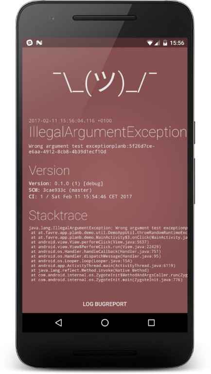
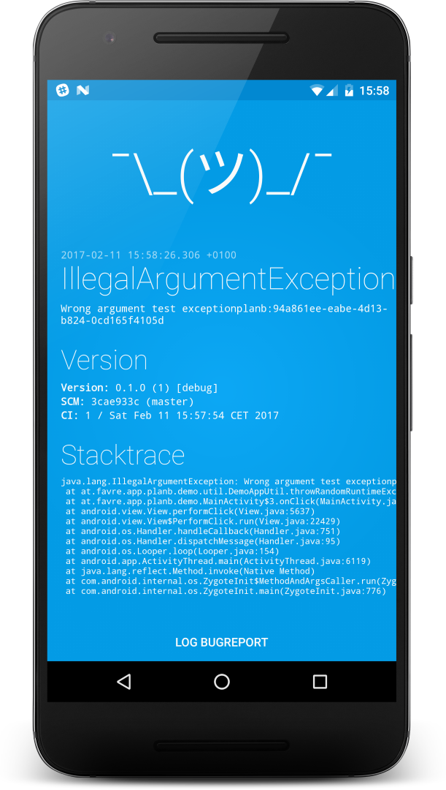

# Plan-B Android Crash Recovery Lib


**THIS IS WORK IN PROGRESS.**


A crash recovery lib

[ ](https://bintray.com/patrickfav/maven/planb/_latestVersion)
[](https://travis-ci.org/patrickfav/planb-android)
[](https://play.google.com/store/apps/details?id=at.favre.app.planb.demo)





## Quick Start

Add the following to your dependencies ([add jcenter to your repositories](https://developer.android.com/studio/build/index.html#top-level) if you haven't)

```gradle
compile 'at.favre.lib:planb:x.y.z'
```

# Integration with Crash Frameworks

## HockeyApp

## Crashlytics

## Acra

## Similar Projects:

* [Recovery](https://github.com/Sunzxyong/Recovery)

# License

Copyright 2017 Patrick Favre-Bulle

Licensed under the Apache License, Version 2.0 (the "License");
you may not use this file except in compliance with the License.
You may obtain a copy of the License at

    http://www.apache.org/licenses/LICENSE-2.0

Unless required by applicable law or agreed to in writing, software
distributed under the License is distributed on an "AS IS" BASIS,
WITHOUT WARRANTIES OR CONDITIONS OF ANY KIND, either express or implied.
See the License for the specific language governing permissions and
limitations under the License.